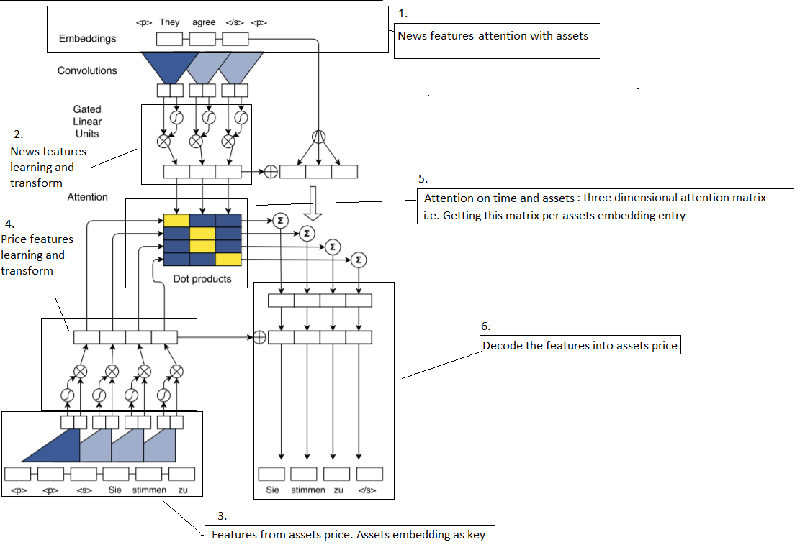

Jupyter Notebook Kaggle_2Sigma Last Checkpoint: a few seconds ago (autosaved) Python 3
Python 3 
File
Edit
View
Insert
Cell
Kernel
Widgets
Help

###
# Kaggle2Sigma
About this competition read the link: https://www.kaggle.com/c/two-sigma-financial-news
Which include explanation to the competition and the data.
​
For the project, these sources are setup for use.
    - Trello: https://trello.com/kaggle2sigma
    - Google Drive: https://drive.google.com/drive/folders/1pW6ZFw9es4CLpMq67rbtjhxD20LBLmGH?usp=sharing
    - Slack: https://pythonnmlinterest.slack.com/messages/CDLF9UR4M/
​
## Datasets
https://www.kaggle.com/c/two-sigma-financial-news/data
​
To fetch a larger dataset for experiment and local development:
https://www.kaggle.com/ckpoon19890129/experimental-data-download/output?scriptVersionId=6755809
​
​
## Utilities
    -How to Google Colab with kaggle: https://medium.com/@move37timm/using-kaggle-api-for-google-colaboratory-d18645f93648
    -The submission will be in the form of kaggle kernel: https://www.kaggle.com/docs/kernels#types-of-kernels
    -To load the data and making submission: https://www.kaggle.com/dster/two-sigma-news-official-getting-started-kernel
​
## Project Plan
1. Brain-storming ideas and research for relevant techniques and resources
2. Baseline models
3. Implementation of ideas and experiments
4. Consolidation
5. (1)-(4) iterations
​
## 1. Ideas & Research
​
### Stocks similarity:
    - stocks embedding: 
        - Price correlations initialisation
        - Each stock as trainable variables
    - Entity tagging: https://spacy.io/api/
​
### News Summarisation:
    https://arxiv.org/pdf/1705.03122.pdf
    - word/document embeddings: word2vec, fasttext, NNLM - google news, universal sentence encoder
    - attention mechanism: 
        - Using stock similarity embeddings and news objects colume to form attention-key pairs
    - Convolution embedding
​
- Quantify signals:
    - Time series features engineering: 
        - Reference to EEG detection challenge:http://blog.kaggle.com/2015/10/05/grasp-and-lift-eeg-detection-winners-interview-3rd-place-team-hedj/
    - Percentage changes
    - Price trend: smoothed gradient, moving average etc.
    - Volatility: price variations
​
### Possible Models:
    Two predictive elements: 
        - News
        - Price Records(latent state)
​
    - CNN translation with attention: https://arxiv.org/pdf/1705.03122.pdf 
    - seq2seq model: https://github.com/Arturus/kaggle-web-traffic/blob/master/how_it_works.md
​
### Baseline kernels:
    - Classifier/regression models:
        - lgb: https://www.kaggle.com/kazuokiriyama/tuning-hyper-params-in-lgbm-achieve-0-66-in-lb

​
